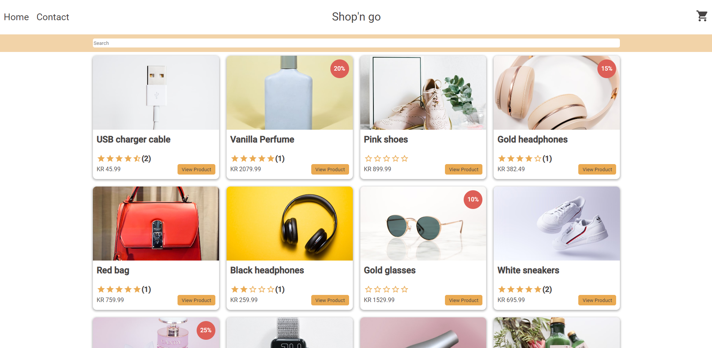

# Your project title



A simple overview of the use/purpose of the project.

## Description

In this project, i was tasked with creating an e-commerce site using react, I also had to get the data from an API.
The Main goal of this assicnmeng wad to show my technical skills in react, the design was not that important for this project.

Since I needed to store the cart temporarily while using the site, I decided to use Redux toolkit, an powerful state management tool for react.
In combination with Redux toolkit, I used the session storage to store the cart, updating the sessionstorage all the time trough a middleware.

the contact form was made using react hook form, and yup for validation, making it easy to validate and give response on the form.

I where free to use any css framework i wanted, so i decided to use an combination of MUI and my own styled components.

Criterias for the project:

- Fetch all products from the API and display them in a list.
- Fetch a single product from the API and display it on a separate page.
- Add a product to the cart.
- checkout the cart and remove the products from the cart.
- A contact page with a form to send a message.

## Built With

Here are the Packages i have used for this project:

- [React](https://reactjs.org/)
- [MUI](https://mui.com/)
- [Redux toolKit](https://redux-toolkit.js.org/)
- [yup](https://www.npmjs.com/package/yup)
- [React Hook form](https://react-hook-form.com/)
- [Styled components](https://styled-components.com/)
- [React router](https://reactrouter.com/en/main)

## Getting Started

### Installing

To replicate the project locally, follow these steps:

1. Clone the repo:

```bash
git clone https://github.com/puggen1/js-frameworks-ca-bendik.git
```

2. Install the dependencies:

```
npm install
```

### Running

To run the app, run the following commands:

start:

```bash
npm run start
```

build:

```bash
npm run build
```

## Contributing

If you would like to help contribute to the project, there are a few ways you can do this:

### open a issue

If you have found a problem, please open a issue and try to describe the problem as good as possible, as well as how to replicate it.

### open a pull request

If you have a solution to a problem, you can open a pull request and i will review it.
feel free to open a pull request if you have any suggestions for improvements as well.

## Contact

If you have any questions or would like to contact me, you can do so through:

[LinkedIn profile](https://www.linkedin.com/in/bendik-kvam)

## Improvements

- Added a response for the contact form, a snackbar popup and text besides submit button.
